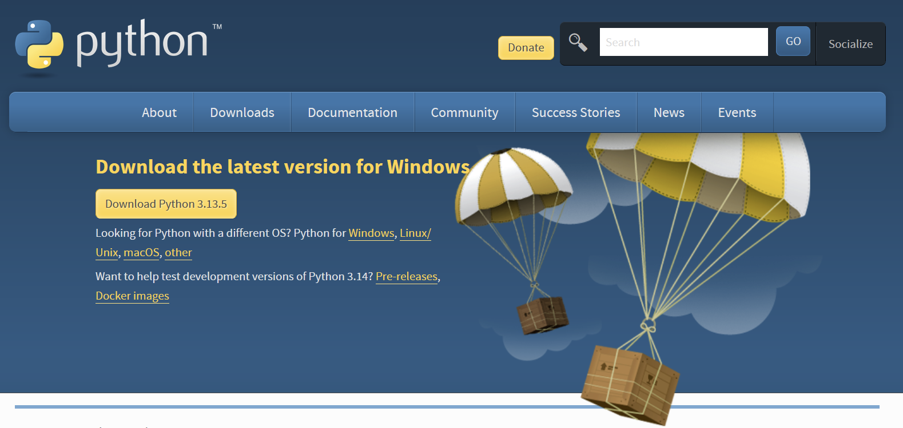
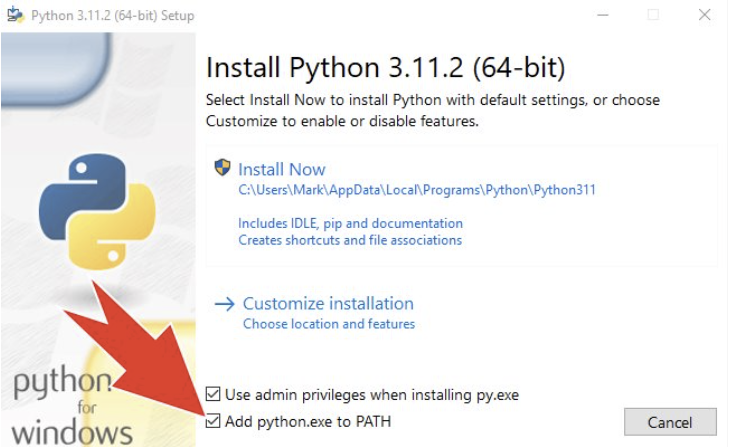
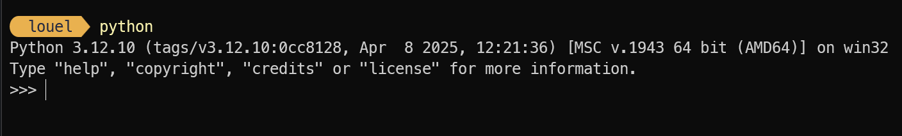
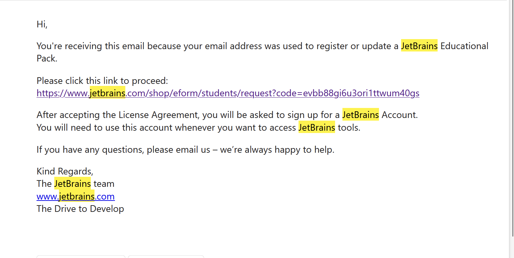
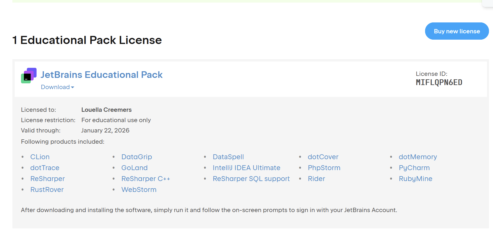
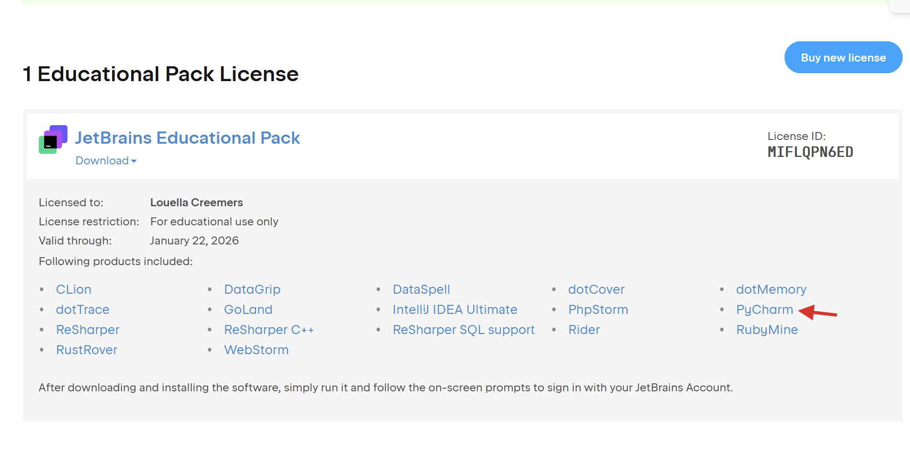
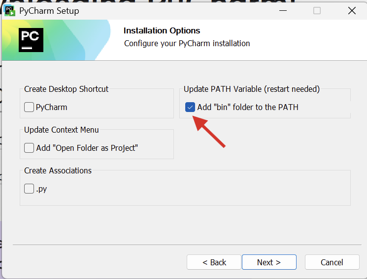
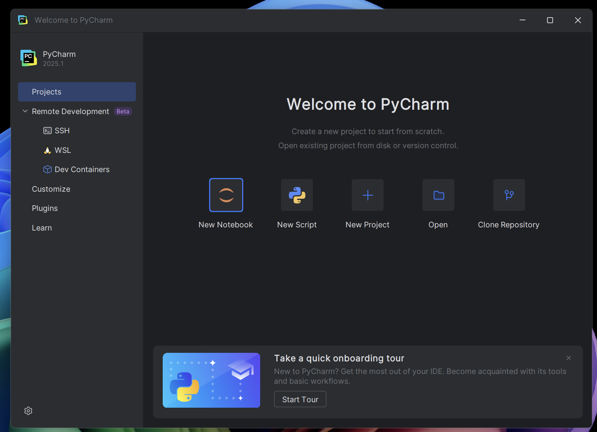
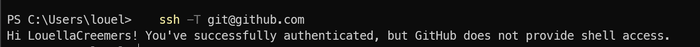

# Workshop Intro
Welkom bij de Introductieweek voor software development! In dit document kan je een makkelijk overzicht vinden hoe je alles kan installeren en klaar kan zetten voor de lessen die volgen. Alles wat in dit document behandeld wordt, wordt uitgebreider uitgelegd tijdens de lessen en werkplaats.

## Short list
* Installeer Python (https://python.org)
* Vraag de Jetbrains Student Pack aan (https://www.jetbrains.com/academy/student-pack/)
* Installeer PyCharm (https://www.jetbrains.com/pycharm/)
* Maak een GitHub account aan (https://github.com/)
* Installeer Git
* Maak een SSH key aan
* Voeg SSH key toe aan GitHub

---

## Python installeren
1. Ga naar [python.org/downloads](https://python.org/downloads).
2. Klik op de link onder de gele button met `Get the standalone installer for Python 3.x.x`


De versie die jij ziet in de knop kan anders zijn dan die in de screenshot. Dat maakt niks uit.

3. Start de installer<br>
Op Windows: dubbelklik op het gedownloade .exe-bestand.
Op macOS: open het .pkg-bestand.

4. **ALLEEN WINDOWS** Voeg Python toe aan je PATH en doorloop de installer
Als je de installer opent krijg je dit scherm te zien. Zorg dat de PATH checkbox aangevinkt is.<br>


Klik daarna op "Install Now", en accepteer alles met de standaard opties totdat je installatie voltooid is.

5. Check of Python werkt in de terminal<br>
Voor Windows: Typ `Powershell` in je zoekbalk en open deze.<br>
Voor MacOS: Klik `CMD+Spatie` en typ dan vervolgens `Terminal` en open deze.

Als je al een Terminal open hebt staan, open die dan opnieuw.

Typ vervolgens `python`, `py`, of voor MacOS `python3` in je terminal en klik op Enter. Je zal de versie van Python die je ingestalleerd heb staan moeten zien:


Dit is een teken dat Python werkt! Je kan nu je terminal sluiten.

---

## JetBrains Educational Pack (gratis licentie) aanvragen 
Voor de lessen gebruiken we een programmeer omgeving (IDE) genaamd PyCharm. PyCharm is van het bedrijf JetBrains en de volledige versie van deze omgeving kost normaal gesproken geld. Gelukkig kan je gratis toegang krijgen door de Jetbrains educational pack aan te vragen.

1. **Open** je browser en ga naar <https://www.jetbrains.com/academy/student-pack/>  
2. Klik op de grote **Request Now** knop  
3. Vul het formulier in – zo kan het eruitzien:  

   * **Country:** Netherlands  
   * **Level of study:** Undergraduate  
   * **Field of study:** Computer Science  
   * **e‑mail address:** je HR‑mailadres  
   * **Personal e‑mail:** je privémail  

4. Klik op **Apply for free products** en wacht even  
5. Je ontvangt een e‑mail op je HR‑mail. Klik op de link in die mail  
   
6. Log in of maak een JetBrains‑account aan  
7. In je profiel (via <https://account.jetbrains.com/licenses>) zie je nu dat de **JetBrains Educational Pack** actief is:  
   

---

## PyCharm installeren

1. Terwijl je bent ingelogd bij JetBrains, ga naar <https://account.jetbrains.com/licenses>  
2. Zoek onder **Educational Pack** naar **PyCharm** (zie rechts in het screenshot)  
   
3. Klik op de Pycharm pagina op de **Download** knop

4. Kies de juiste installer voor jouw besturingssysteem (Windows, macOS of Linux) en download deze  
5. Start de installer:  
   * **Windows:** dubbelklik op het `.exe`‑bestand  
   * **macOS:** open het `.dmg`‑bestand en sleep PyCharm naar **Applications**  
   * **Linux:** pak het `.tar.gz`‑archief uit en volg de README  

6. **ALLEEN WINDOWS** Bij installatie opties vink de PATH checkbox aan. Zie hiervoor de screenshot.
    Optioneel: 
   * Bureaublad‑icoon nodig? Vink **Create Desktop Shortcut** aan  
   * Altijd Python‑bestanden in PyCharm openen? Vink **Create Association** aan



8. Doorloop de rest van de installer en wacht tot de installatie klaar is  
9. Zoek *PyCharm* via je start‑ of launcherscherm en open het. Zie je het welkomstscherm? Top! PyCharm is klaar voor gebruik.
   

---
## GitHub Account aanmaken
GitHub is het platform waar wij jullie code gaan nakijken, maar ook waar jullie gaan samenwerken aan code. Het is ook waar je nu deze README op bekijkt.

Sommige van jullie hebben waarschijnlijk al een account. Kies hieronder wat geldt voor jou:

<details>
<summary><strong>Ik heb al een account</strong></summary>

Als je al een account hebt zijn er 2 opties:

1. Pas je gebruikersnaam aan naar `voornaam-studentnummer` (bijv. `jan-1234567`).  
   Ga naar **Settings ▸ Account** en klik op **Change username**.

2. Maak een nieuw GitHub‑account aan en volg het kopje **Ik heb nog geen GitHub‑account** hieronder.

Dit helpt ons voorkomen dat we straks moeten uitzoeken wie `hetekaastosti301` is op GitHub tijdens het nakijken. 😅

</details>

<details>
<summary><strong>Ik heb nog geen GitHub-account</strong></summary>

1. **Open** <https://github.com/signup>  
2. Maak een **gebruikersnaam** aan dat het volgende patroon volgt: `voornaam-studentnummer`, bijvoorbeeld `jan-1234567`.  
3. Gebruik je **privé‑e‑mail** als hoofdadres en stel een sterk **wachtwoord** in.  
4. Klik op **Create account** en voltooi de CAPTCHA en e‑mail­verificatie.  
5. Na het inloggen:  
   * Klik op je profielfoto rechtsboven in de hoek. Ga naar **Settings** en dan **Emails**.
     * Controleer dat je privé‑e‑mail op **Verified** staat en maak het je **Primary email**.  
     * Voeg je **HR‑e‑mail** toe en verifieer ook deze.  

Dit is nu ook klaar. Je GitHub‑account is actief én blijft van jou nadat je bent afgestudeerd!

</details>

---

### Twee-factor-authenticatie (2FA) instellen voor GitHub

Onze GitHub-omgeving is alleen bereikbaar wanneer je account aan de benodigde beveiligingseisen voldoet. Om toegang te krijgen moet je **twee-factor-authenticatie (2FA)** inschakelen. Gebruik hiervoor **geen SMS**, maar een authenticator-app.

1. Klik rechtsboven op je **profielfoto** en ga naar **Settings**.
2. Ga in het menu naar **Password and authentication**.
3. Zoek het onderdeel **Two-factor authentication** en klik op **Enable two-factor authentication**.
4. Kies voor **Authenticator app**.
5. Open een authenticator-app op je telefoon, bijvoorbeeld:

    * Google Authenticator
    * Microsoft Authenticator
    * Authy
    * Een andere authenticator-app die TOTP ondersteunt
6. Scan de QR-code die GitHub laat zien met de authenticator-app.
7. Vul de gegenereerde code in op GitHub om de configuratie te bevestigen.
8. GitHub geeft je vervolgens **recovery codes**. Sla deze codes op een veilige plek op.

   Bewaar je recovery codes bij voorkeur op **meerdere veilige plekken**. Deze codes heb je nodig als je bijvoorbeeld je telefoon of laptop kwijtraakt, een apparaat kapotgaat of je om een andere reden geen toegang meer hebt tot je authenticator-app.

   Je kunt bijvoorbeeld:

    * De recovery codes opslaan in een password manager.
    * Een tweede veilige kopie bewaren op een ander apparaat of een versleutelde opslaglocatie.
    * Een geprinte kopie op een veilige plek bewaren.

   Zorg ervoor dat je recovery codes **niet alleen op hetzelfde apparaat staan als je authenticator-app**. Als dat apparaat verloren gaat of kapotgaat, kun je anders alsnog geen toegang krijgen tot je GitHub-account.

> **Let op:** Gebruik voor 2FA **geen SMS**. Stel een authenticator-app in en bewaar je recovery codes op meerdere veilige plekken, zodat je ook bij verlies of schade van een apparaat toegang tot je account kunt herstellen.

---

## Git Installeren
Git is een versiebeheersysteem dat we gebruiken om code te beheren en samen te werken. Hieronder vind je instructies voor het installeren en configureren van Git.

<details>
<summary><strong>Ik heb nog geen Git geïnstalleerd</strong></summary>

1. **Download Git**:
   * **Windows**: Ga naar [git-scm.com/download/win](https://git-scm.com/download/win) en download de installer.
   * **macOS**: 
     * **Optie 1**: Installeer via [git-scm.com/download/mac](https://git-scm.com/download/mac).
     * **Optie 2**: Als je Homebrew hebt, open Terminal en typ: `brew install git`.
   * **Linux**: Open Terminal en typ (voor Ubuntu/Debian): `sudo apt-get install git`.

2. **Installeer Git**:
   * **Windows**: 
     * Open de gedownloade installer.
     * Accepteer de licentievoorwaarden.
     * Kies de installatielocatie (standaard is prima).
     * Selecteer componenten (standaardselectie is prima).
     * Kies een editor (Vim als standaard is prima).
     * Blijf nu op de **Next** knop klikken totdat je de Install knop ziet.
     * Klik op "Install" en wacht tot de installatie voltooid is.

   * **macOS/Linux**: Volg de instructies in de installer of wacht tot de installatie via de terminal is voltooid.

3. **Controleer de installatie**:
   * Open Terminal (macOS/Linux) of Command Prompt/PowerShell (Windows).
   * Typ `git --version` en druk op Enter.
   * Als je een versienummer ziet (bijv. `git version 2.35.1`), is Git succesvol geïnstalleerd.

4. **Configureer je gebruikersnaam en e-mail**:
   * Open Terminal of Command Prompt/PowerShell.
   * Voer de volgende commando's uit (vervang de gegevens met je eigen informatie):
     ```
     git config --global user.name "GitHub username"
     git config --global user.email "jouw.email@example.com"
     ```
   * Deze informatie wordt gebruikt om je commits te identificeren.

</details>

<details>
<summary><strong>Ik heb Git al geïnstalleerd en heb net mijn gebruikersnaam op GitHub gewijzigd</strong></summary>

Als je net op GitHub je gebruikersnaam hebt gewijzigd moet Git dat wel matchen, anders blijven we je oude username zien.<br>
Doe hiervoor het volgende:

1. **Open Terminal of Command Prompt/PowerShell**.
2. **Controleer je huidige instellingen**:
   ```
   git config --global user.name
   ```
3. **Wijzig je gebruikersnaam en/of e-mail**:
   ```
   git config --global user.name "Nieuwe GitHub Username"
   ```
4. **Controleer of de wijzigingen zijn doorgevoerd**:
   ```
   git config --global user.name
   ```

</details>

---

## SSH Key Aanmaken

Een SSH key stelt je in staat om veilig met GitHub te communiceren zonder telkens je GitHub-inloggegevens te hoeven invoeren.

### 1. Open een terminal

* **macOS/Linux:** open Terminal
* **Windows:** open PowerShell

### 2. Genereer een nieuwe SSH key

```bash
ssh-keygen -t ed25519 -C "jouw.email@example.com"
```

Vervang het e-mailadres door het e-mailadres dat je voor GitHub gebruikt.

### 3. Kies waar de key wordt opgeslagen

Wanneer je wordt gevraagd om een bestandslocatie, druk je op **Enter** om de standaardlocatie te gebruiken.

Als er al een SSH key met dezelfde naam bestaat, overschrijf deze dan niet zomaar. Kies in dat geval een andere bestandsnaam.

### 4. Kies een passphrase

Je kunt een passphrase invoeren om je SSH key extra te beveiligen. Je kunt ook op **Enter** drukken om geen passphrase te gebruiken.

Een passphrase is veiliger en wordt daarom aanbevolen.

### 5. Voeg de SSH key toe aan de SSH-agent

#### macOS/Linux

```bash
eval "$(ssh-agent -s)"
ssh-add ~/.ssh/id_ed25519
```

#### Windows

De Windows SSH-agent moet mogelijk eerst worden ingeschakeld.

Open hiervoor **PowerShell als Administrator** en voer uit:

```powershell
Get-Service -Name ssh-agent | Set-Service -StartupType Manual
Start-Service ssh-agent
```

Sluit daarna het Administrator-venster en open een normale PowerShell.

Voeg vervolgens je SSH key toe:

```powershell
ssh-add $env:USERPROFILE\.ssh\id_ed25519
```

### 6. Kopieer je publieke SSH key

#### macOS

```bash
pbcopy < ~/.ssh/id_ed25519.pub
```

#### Windows

```powershell
Get-Content $env:USERPROFILE\.ssh\id_ed25519.pub | Set-Clipboard
```

#### Linux

```bash
cat ~/.ssh/id_ed25519.pub
```

Kopieer bij Linux de uitvoer handmatig.

Je publieke SSH key staat nu op je klembord en kan worden toegevoegd aan GitHub.

---

## SSH Key Toevoegen aan GitHub 

Stappen voor het toevoegen van je SSH key aan GitHub

1. **Log in op GitHub**.
2. **Klik rechtsboven op je profielfoto** en selecteer **Settings**.
3. **Klik in het zijmenu op "SSH and GPG keys"**.
4. **Klik op "New SSH key"**.
5. **Geef je key een beschrijvende titel** (bijv. "Mijn Laptop" of "School Computer").
6. **Plak je SSH key (Ctrl/CMD + V) in het veld "Key"**.
7. **Klik op "Add SSH key"**.
8. **Bevestig de actie** door je GitHub-wachtwoord in te voeren als daarom wordt gevraagd.
9. **Test je verbinding** door het volgende in je terminal of powershell te typen:
   ```
   ssh -T git@github.com
   ```
   Je krijgt mogelijk een waarschuwing over de authenticiteit van de host. Typ "yes" om door te gaan.
   Als alles goed is geconfigureerd, zie je een bericht zoals: "Hi username! You've successfully authenticated, but GitHub does not provide shell access."

## Gefeliciteerd! Alles staat nu klaar om voorbereid de werkplaats op te gaan
